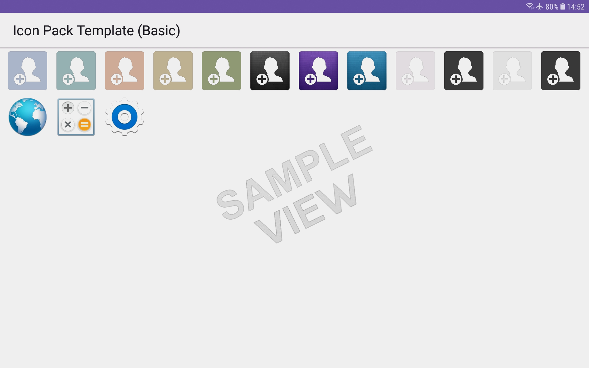

# create-image-gallery-from-the-contents-of-a-website-folder-left-aligned-orphans

created to link and delete old site on google search console

 

A demo, downloads and guide about how to use this template is shown on the github-pages version of this site which you can see by clicking the link below:

 

* [Click this link to visit the website being created from this repository and hosted on github-pages.](https://boxbot6.github.io/create-image-gallery-from-the-contents-of-a-website-folder-left-aligned-orphans/)

 

